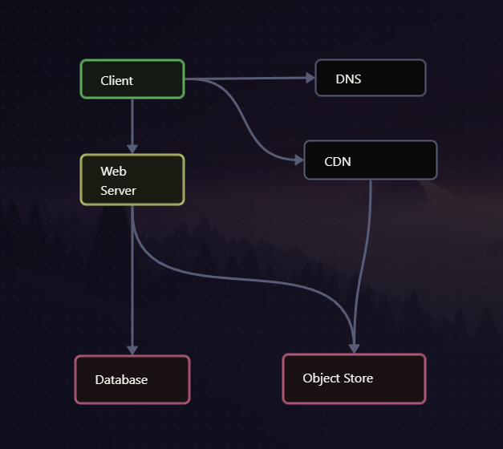

# Burpple Assignment

Full stack application of a restaurant app.

A greater focus was placed on the application's function than its form.

## Pre-requisite

- Docker

## How to start

```sh
docker compose up
```

If any changes are made to the source code:

```sh
docker compose up --build --force-recreate
```

## Tech Stack Rationale

### client

I use **TypeScript** as language because of its type interfaces. It is a superset
of JavaScript so there isn't much learning curve for current JavaScript developers.
TypeScript serves to help catch bugs during development, ensuring stricter coding
standards during development.

**NextJS** enables you to create landing pages and marketing sites that load quickly
and provide excellent SEO benefits. The framework's flexibility allows for easy
integration with marketing tools and analytics, helping you track and optimize
your campaigns effectively.

**Shadcn** was chosen as the UI framework as it offers a minimalistic set of
components and utilities, allowing developers to build custom interfaces without
the overhead of a full-fledged component library.

### server

**Rust** is definitely an overkill for an application such as this. But i used it
for this project because of my familiarity with it. Rust is a performant language
due to its lack of garbage collector and also due to its ownership system.
It has an initial steep learning curve, but the payoffs are great:

- high throughput if computing is a bottleneck
  - depending on application, it can be at least 100x faster than other languages
- exceptional error handling

**Axum** was chosen because of its popularity and the **tokio.rs** being the
organization backing it.

### Architecture



## Unimplemented features

- uploading and loading of images
  - not enough aws credits
